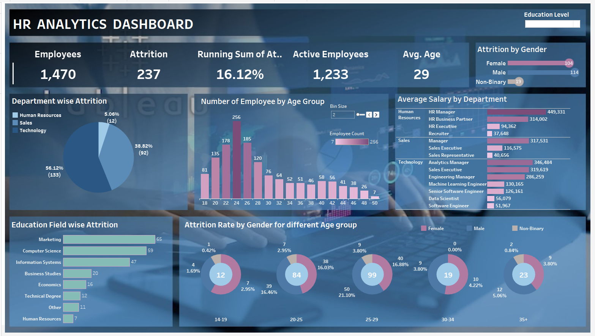

# Data Vizualization
## 1) Tableau HR Dashboard 
### About Datasets:
This HR dashboard utilizes three main datasets: Performance Rating, Employee Data, and Education Level. These datasets are essential for generating insights and visualizations related to employee performance and satisfaction.

Performance Rating Dataset  |
File Name: performance_rating.csv

Description: This dataset contains performance ratings for employees, including unique identifiers (PerformanceID and EmployeeID), review dates (ReviewDate), ratings on work environment satisfaction (EnvironmentSatisfaction), job satisfaction (JobSatisfaction), relationship satisfaction (RelationshipSatisfaction), training opportunities within a year (TrainingOpportunitiesWithinYear), training opportunities taken (TrainingOpportunitiesTaken), work-life balance (WorkLifeBalance), self-ratings of performance (SelfRating), and ratings provided by managers or supervisors (ManagerRating).

Employee Data Dataset  |
File Name: employee.csv

Description: This dataset provides detailed information about employees, including their unique identifiers (EmployeeID), first names (FirstName), last names (LastName), genders (Gender), ages (Age), business travel frequency (BusinessTravel), departments (Department), distances from home in kilometers (DistanceFromHome), states (State), ethnicities (Ethnicity), education levels (Education), education fields (EducationField), job roles (JobRole), marital statuses (MaritalStatus), salaries (Salary), stock option levels (StockOptionLevel), overtime status (OverTime), hire dates (HireDate), attrition status (Attrition), years at the company (YearsAtCompany), years in the most recent role (YearsInMostRecentRole), years since the last promotion (YearsSinceLastPromotion), and years with the current manager (YearsWithCurrManager).

Education Level Dataset  |
File Name: education_level.csv

Description: This dataset focuses on the different education levels attained by employees. It includes EducationLevelID, a unique identifier for each education level, and EducationLevel, indicating the specific education level achieved.
Please make sure to place the corresponding dataset files in the designated file locations mentioned above or update the file paths accordingly.

 
